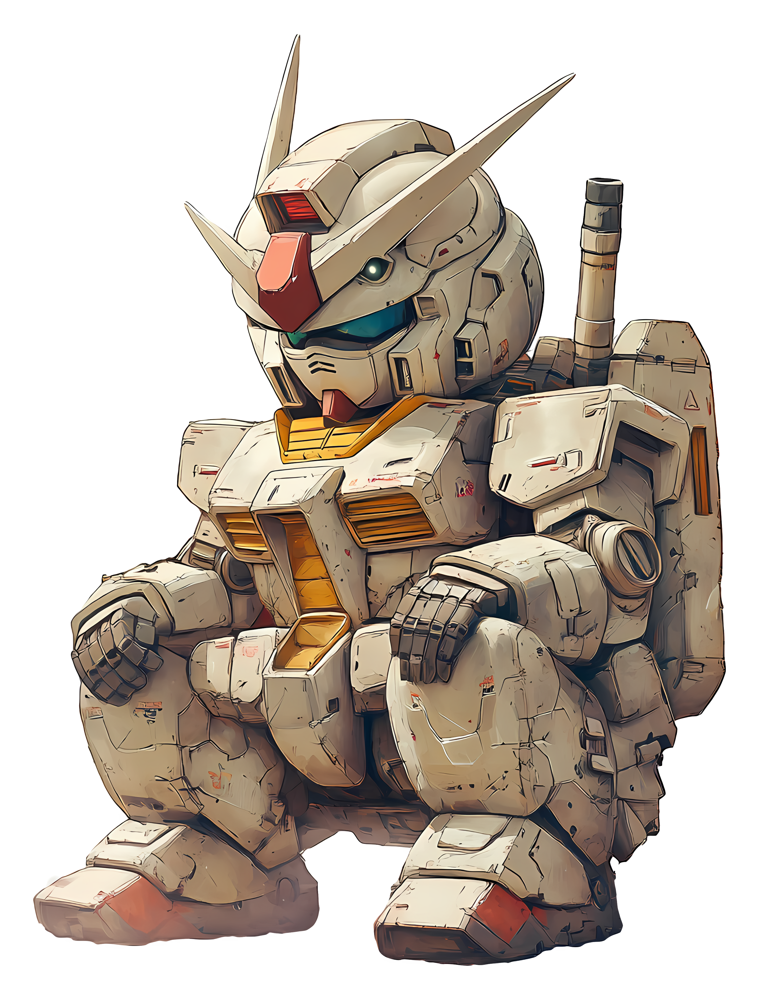

# **Captain's Log — Signals Received from Beyond the Horizon**

**Astral Union Flight Record · Access: Open**

---

---

This repository holds the session logs of an Apollonian pilot and **RX-782**, a newly built Mech with a salvaged Ion Core and a past neither of them knows.

Each entry records a session of **ION Heart** — the worlds we reach, the people we meet, the ones we manage to help, and the questions the Core leaves unanswered.

---

> *Same spirit. A softer tomorrow.*
